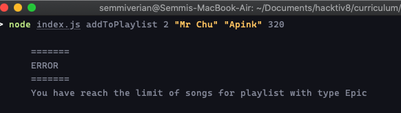

# Hacktiv Tunes

> ⏰ Time 120 minutes

## Summary

Kalian diminta untuk membuat aplikasi bernama `hacktiv Tunes` yang akan menampilkan `Playlist` yang merupakan kumpulan `lagu` yang disukai oleh user.

## Release 0

Buatlah sebuah class `Playlist` yang memiliki property:

| property | description                                                 |
| -------- | ----------------------------------------------------------- |
| id       | `id` dari sebuah `Playlist`                                 |
| name     | `name` dari sebuah `Playlist`                               |
| type     | `type` dari sebuah `Song`                                   |
| limit    | `limit` `Song` yang bisa ditambahkan pada sebuah `Playlist` |
| songs    | Kumpulan instance dari class `Song`                         |

Dimana class `Song` memiliki property:

| property | description                                                    |
| -------- | -------------------------------------------------------------- |
| name     | `name` dari sebuah `Song`                                      |
| group    | `group` yang menyanyikan sebuah `Song`                         |
| duration | `duration` dari sebuah `Song` yang dibuat dalam hitungan detik |

Terdapat tiga type `Playlist` yang bisa didaftarkan yaitu:

- Mythic

  - Memiliki `limit` 10 `Song` yang dapat ditampung

* Legend

  - Memiliki `limit` 5 `Song` yang dapat ditampung

- Epic

  - Memiliki `limit` 2 `Song` yang dapat ditampung

Buatlah class class yang diperlukan sesuai dengan requirement diatas.

## Release 1

`FORMAT DATA PADA "data.json" TIDAK BOLEH DIUBAH.`

Buatlah sebuah controller yang memiliki fitur:

1.  Buatlah fitur untuk menampilkan seluruh `Playlist` bersamaan dengan `Song` yang terdapat pada `Playlist` tersebut berdasarkan data yang ada pada file `data.json`.

    - Command yang dijalankan

      ```bash
        $ node index.js show
      ```

    - Output yang diharapkan

      

2.  Buatlah fitur untuk menghapus `Playlist` yang ada:

    - Command ini akan menghapus `Playlist` yang berada pada `data.json` sesuai dengan `id` yang diminta
    - Format command yang harus dilakukan untuk menghapus `Playlist` baru adalah
      ```bash
        $ node index.js delete <id>
      ```
    - Contoh penggunaan command ini
      ```bash
        $ node index.js delete 1
      ```
    - Output yang diharapkan

      

## Release 2

Buatlah sebuah fitur yang dapat menambahkan sebuah `Song` kepada `Playlist` yang sudah ada.

- Format command yang harus dilakukan untuk menambahkan `Song` baru ke sebuah `Playlist` adalah

  ```bash
  $ node index.js addToPlaylist <idPlaylist> <songName> <songGroup> <songDuration>
  ```

- Contoh penggunaan command ini

  ```bash
   $ node index.js addToPlaylist 1 "Mr Chu" "Apink" 320
  ```

  - Output yang diharapkan

    

Ada beberapa rule validasi yang harus dipenuhi untuk menambahkan `Song` baru

1. Pastikan `Playlist` dapat menampung `Song` baru dengan memastikan limit `Playlist` masih lebih besar dibandingkan dengan jumlah `Song` yang sudah ada.

   - Output ketika error terjadi

     

2. Pastikan `id` dari `Playlist` tersebut benar benar ada di dalam `data.json`

   - Output ketika error terjadi

     

## Release 3

Buatlah sebuah fitur `detail` yang akan menampilkan list `Song` yang terdapat pada sebuah `Playlist`

- Buatlah sebuah getter/instanceMethod `durationInMinute` yang akan menampilkan `duration` dari sebuah `song` dengan format menit:
  contoh:
  ```
    duration = 300
    durationInMinute = 5:00
    =====
    duration = 150
    durationInMinute = 2:30
  ```
- Dapat mengguanakan `console.table()` untuk mendapatkan format sesuai dengan ekspektasi.
- Formmat command yang harus dijalankan
  ```bash
    $ node index.js detail <id>
  ```
- Expected output

  
